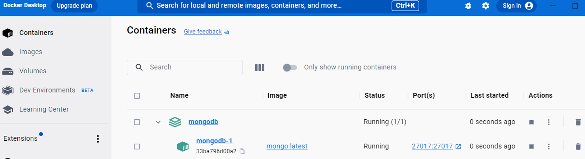
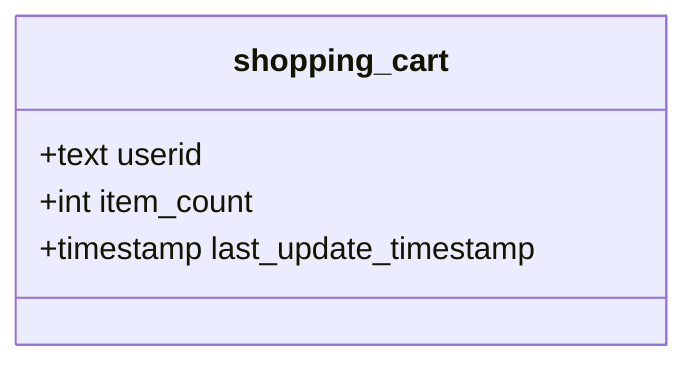
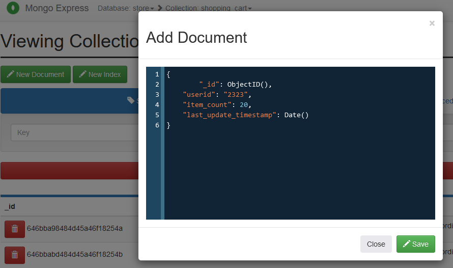
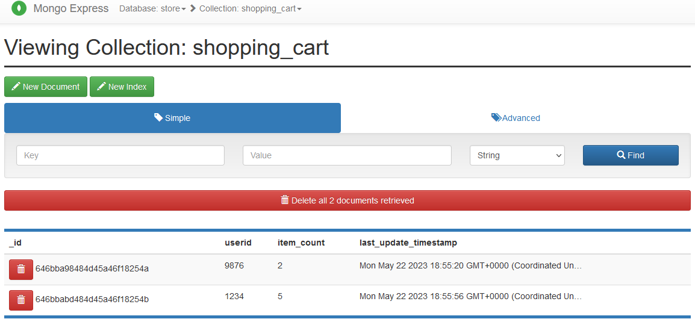

# MongoDB Hands-on
In this tutorial you will learn:
1. How to set up a single MongoDB instance
2. How to handle data in MongoDB
3. How to query data in MongoDB
4. How to set up a cluster of MongoDB nodes
## Requirements
- Docker (https://docs.docker.com/get-docker)

## Step 1: Create a directory or clone the project
Create a directory named mongodb and enter the directory (this will be your working directory). If you have cloned this git repository, you can skip this step.
```sh
mkdir mongodb
cd mongodb
```

## Step 2: Define a single MongoDB node
Create a docker-compose file `docker-compose.yml` where you will define the docker container for one single instance of MongoDB.

The `docker-compose.yml` should look like this (you can use any text editor like `vi`, `nano` and `WordPad` or GUI to write the compose file). You can find an example in [docker-compose-single.yml](docker-compose-single.yml) or do `cp docker-compose-single.yml docker-compose.yml` (if you have cloned the git repo):
```yml
version: '3'

networks:
  tutorial:
    name: tutorial

services:
  mongodb:
    image: mongo:4.2.24-bionic
    networks:
      - tutorial
    ports:
      - "27017:27017"
```
Save the file and close the editor.

You have created a docker-compose file where you have defined one containerised service of MongoDB, using the last MongoDB image from DockerHub. The container has the port 27027 opened and mapped to the internal port 27027 of MongoDB. It is also connected to a network called *tutorial* . You will later use the network to connect more services together.

## Step 3: Let's run MongoDB
To run the MongoDB instance using Docker (using `-d` to detach the container from the terminal). The docker compose file must be named `docker-compose.yml`
```sh
docker compose up -d
```

From DockerDesktop you can see if the container is running:


Another alternative is to use the terminal. To check the running projects in docker, you can use the following. It lists the project and the number of containers, in this case, it will show only 1 container.
```sh
docker compose ls
```

You should see something like:

```
NAME                STATUS              CONFIG FILES
mongodb             running(1)          D:\teckna\big-data-workshop\mongodb\docker-compose.yml
```

To list the containers and see more information such as their state:

```sh
docker compose ps
```

You should see something like:
```
NAME                IMAGE                 COMMAND                  SERVICE             CREATED              STATUS              PORTS
mongodb-mongodb-1   mongo:4.2.24-bionic   "docker-entrypoint.s…"   mongodb             About a minute ago   Up About a minute   0.0.0.0:27017->27017/tcp
```

## Step 4: Check connection to MongoDB
Let's check if we can connect by opening an interactive shell (you may need to wait until MongoDB finishes the set-up and starts accepting connections):

```docker
docker run --network tutorial --rm -it rtsp/mongosh mongosh -- mongodb://mongodb:27017
```

If the connection succed, it will show:

```
Current Mongosh Log ID: 646bad6e09f971a1b94c86fb
Connecting to:          mongodb://mongodb:27017/?directConnection=true&appName=mongosh+1.9.0
Using MongoDB:          4.2.24
Using Mongosh:          1.9.0

For mongosh info see: https://docs.mongodb.com/mongodb-shell/
test>
```

You can type `exit` to leave.

## Step 5: MongoDB is running but we want to see the DB
You can stop MongoDB and extend the docker compose to add a new service to visualise MongoDB.

To stop and remove the containers you can use:
```sh
docker compose down
```

Let's add a new service for visualising MongoDB as in [docker-compose-gui.yml](docker-compose-gui.yml) or do `cp docker-compose-gui.yml docker-compose.yml`. Once you have the new docker-compose file, you can run it with `docker compose up -d`. If you have not removed the containers, you will observe that docker recreates the MongoDB instance. 

```yml
version: '3'

networks:
  tutorial:
    name: tutorial

services:
  mongodb:
    image: mongo:4.2.24-bionic
    networks:
      - tutorial
    ports:
      - "27017:27017"

  mongo_express:
    image: mongo-express
    networks:
      - tutorial
    ports:
      - target: 8081
        published: 8081
    environment:
      ME_CONFIG_MONGODB_SERVER: mongodb
    command: /bin/bash -c "sleep 60 && /docker-entrypoint.sh mongo-express"
    depends_on:
      - mongodb
```

Now you can open the browser and see your MongoDB instance (this can take around 5 minutes to connect with MongoDB).

>http://localhost:8081


You should see something like this:


## Step 5: Load some data and query

This step can be done either from a command line or using the web UI at http://localhost:8081 .

In the web UI, you can click on *Create Database* (top-right corner).

From the command line. First we need to run the Mongo shell: 

```docker
docker run --network tutorial --rm -it rtsp/mongosh mongosh -- mongodb://mongodb:27017
```

MongoDB uses collections to organise the databases. Similar to namespaces in other databases. By executing the folling sentence, you can create a new database named `store`. This database can contain collections, which are analogous to tables.

```mongo
use store
```

MongoDB is a schema-free database, thefore you do not need to define the data structure. In this case, to instantiate the shopping cart class, you only need to create an instance in a collection named `shopping_cart` (if the collections does not exist, MongoDB will create it):


To create an instance of the class, you can use:

```sh
db.shopping_cart.insertOne({ userid: "9876", item_count: 2, last_update_timestamp: Date() })
```
To add some documents, you can use the following sentences:

```sh
db.shopping_cart.insertOne({ userid: "2356", item_count: 10, last_update_timestamp: Date() })
db.shopping_cart.insertOne({ userid: "1234", item_count: 5, last_update_timestamp: Date() })
```

To add many documents you can do, where instead of a single document, you can specify a list of documents:
```sh
db.shopping_cart.insertMany([{ userid: "6655", item_count: 16, last_update_timestamp: Date() }, { userid: "hd54", item_count: 58, last_update_timestamp: Date() }])
```

You can also do it one the web UI by using the option create document:
On the web UI, you can also visualise the rows.


To visualise the created documents, you can execute:
```sh
db.shopping_cart.find({})
```

This should return:

```sh
[
  {
    _id: ObjectId("646bba98484d45a46f18254a"),
    userid: '9876',
    item_count: 2,
    last_update_timestamp: 'Mon May 22 2023 18:55:20 GMT+0000 (Coordinated Universal Time)'
  },
  {
    _id: ObjectId("646bbabd484d45a46f18254b"),
    userid: '1234',
    item_count: 5,
    last_update_timestamp: 'Mon May 22 2023 18:55:56 GMT+0000 (Coordinated Universal Time)'
  }
]
```

On the web UI, you can also visualise the rows.



### Different keys on the same collection

As the schema of mongo collections is flecible, documents can also be created with new keys. In this case you create a new document with the key 'name'. Note that the key _id is not new as it is always created by MongoDB to index the documents, even when you do not especify it:

```sh
db.shopping_cart.insterOne({ _id: ObjectId("6474f575644"), userid: "6655", item_count: 16, last_update_timestamp: Date(), name: "Max" })
```

What would happend if you try to retrive a document that does not have a key?

First, you can create a new document:
```sh
db.shopping_cart.insterOne({ _id: ObjectId("90ds6bsdb9fdd7"), userid: "6655", item_count: 16, last_update_timestamp: Date() })
```

The you can try to retrive it:
```sh
db.shopping_cart.find({ _id : ObjectId("90ds6bsdb9fdd7")},{_id:0,name:1})
```

It will return a list with an empty document: `[ {} ]`

Something similar would happend if you retrieve all documents and project only the key 'name'.

```sh
db.shopping_cart.find({},{_id:0,name:1})
```

This will return a list of documents with empty documents and some with the key 'name',  something like `[ {}, { name: 'Max' }, {}, {} ]`

>In both case, you must be careful, as this can propagate errors. For example, in Python, if the returned document is handled as an empty dictionary, you will get an error if you try to access the key 'name' or any other key that does not exist in the empty document.

To find the keys of your collection, you can do:

```sh
db.shopping_cart.aggregate([ {"$project":{"arrayofkeyvalue":{"$objectToArray":"$$ROOT"}}}, {"$unwind":"$arrayofkeyvalue"}, {"$group":{"_id":null,"allkeys":{"$addToSet":"$arrayofkeyvalue.k"}}} ])
```


## (Optional) Step 6: Create a cluster of replicas
**Creating a cluster of two or more nodes requires a lot of resources, it may not run on your computer.**

MongoDB has two replication modalities: mirrors of replicas and sharding. Now we are going to setup a cluster of mirrors of replicas, where each replica has the same data as the others (like a mirror).

For this you can use the following docker-compose or do `cp docker-compose-cluster.yml docker-compose.yml` (if you have cloned the git repo):

```yml
version: '3'

networks:
  tutorial:
    name: tutorial

services:
  mongodb1:
    image: mongo:4.2.24-bionic
    networks:
      - tutorial
    ports:
      - target: 27017
        published: 27017
    command: mongod --replSet cluster

  mongodb2:
    image: mongo:4.2.24-bionic
    networks:
      - tutorial
    ports:
      - target: 27017
        published: 27018
    command: mongod --replSet cluster
    depends_on:
      - mongodb1

  mongo_express:
    image: mongo-express
    networks:
      - tutorial
    ports:
      - target: 8081
        published: 8081
    environment:
      ME_CONFIG_MONGODB_SERVER: mongodb1
    command: /bin/bash -c "sleep 60 && /docker-entrypoint.sh mongo-express"
    depends_on:
      - mongodb1
      - mongodb2
```

Once the instances are running, you need to configure the cluster. First, access to any of the instances with:

```docker
docker run --network tutorial --rm -it rtsp/mongosh mongosh -- mongodb://mongodb1:27017
```

Then, execute the configuration:

```
rs.initiate({
 _id: "cluster",
 members: [
   {_id: 0, host: "mongodb1"},
   {_id: 1, host: "mongodb2"}
 ]
})
```
Finally, check if the cluster is correct with:
```
rs.status()
```

You should get something like:
```sh
...
members: [
    {
      _id: 0,
      name: 'mongodb1:27017',
      health: 1,
      state: 1,
      stateStr: 'PRIMARY',
      uptime: 387,
      optime: { ts: Timestamp({ t: 1684784370, i: 1 }), t: Long("1") },
      optimeDate: ISODate("2023-05-22T19:39:30.000Z"),
      syncingTo: '',
      syncSourceHost: '',
      syncSourceId: -1,
      infoMessage: '',
      electionTime: Timestamp({ t: 1684784029, i: 1 }),
      electionDate: ISODate("2023-05-22T19:33:49.000Z"),
      configVersion: 1,
      self: true,
      lastHeartbeatMessage: ''
    },
    {
      _id: 1,
      name: 'mongodb2:27017',
      health: 1,
      state: 2,
      stateStr: 'SECONDARY',
      uptime: 353,
      optime: { ts: Timestamp({ t: 1684784370, i: 1 }), t: Long("1") },
      optimeDurable: { ts: Timestamp({ t: 1684784370, i: 1 }), t: Long("1") },
      optimeDate: ISODate("2023-05-22T19:39:30.000Z"),
      optimeDurableDate: ISODate("2023-05-22T19:39:30.000Z"),
      lastHeartbeat: ISODate("2023-05-22T19:39:31.888Z"),
      lastHeartbeatRecv: ISODate("2023-05-22T19:39:31.686Z"),
      pingMs: Long("0"),
      lastHeartbeatMessage: '',
      syncingTo: 'mongodb1:27017',
      syncSourceHost: 'mongodb1:27017',
      syncSourceId: 0,
      infoMessage: '',
      configVersion: 1
    }
  ],
  ok: 1
...
```

## Step 8: Setup a distributed cluster
Instead of setting up replicas that are mirrors, we can distribute the data across nodes. For this, we need a more complex setup: at least one instance as router, one as configuration, and two or more nodes to store data. The different type of instances can be horisontaly scaled too.


Data is stored in shards and the shards are distributed according to some keys in each collection. The election of the keys for sharding is important as this can effect the perfomance but also determine how balanced will be the distribution.


To setup the shared claster, you can use the following docker-compose or do `cp docker-compose-sharded.yml docker-compose.yml` (if you have cloned the git repo) or find it here [docker-compose-sharded.yml](docker-compose-sharded.yml):

```yml
version: '3'

networks:
  tutorial:
    name: tutorial

services:
  mongodb1: # mongoDB data store 1. The data is stored in MongoDB1 and MongoDB1
    image: mongo:4.2.24-bionic
    networks:
      - tutorial
    ports:
      - target: 27017
        published: 27017
    command: mongod --shardsvr --replSet clustershard --port 27017

  mongodb2: # mongoDB data store 2
    image: mongo:4.2.24-bionic
    networks:
      - tutorial
    ports:
      - target: 27017
        published: 27018
    command: mongod --shardsvr --replSet clustershard --port 27017
    depends_on:
      - mongodb1

  mongocf: # Mongo config. It manages the configuration and metadata of the sharding. It can be also set up as a cluster.
    image: mongo:4.2.24-bionic
    networks:
      - tutorial
    ports:
      - target: 27017
        published: 27019
    command: mongod --configsvr --replSet clustercf --port 27017
    depends_on:
      - mongodb1
      - mongodb2

  mongos: # Mongos acts as a router and also manages the sharding
    image: mongo:4.2.24-bionic
    networks:
      - tutorial
    ports:
      - target: 27017
        published: 27021
    command: mongos --configdb clustercf/mongocf:27017 --port 27017 --bind_ip_all
    depends_on:
      - mongocf
```

Once the cluster is up and running, you need to configure it.

1. Configure the Config server. For this you will use the mongosh:

```sh
docker run --network tutorial --rm -it rtsp/mongosh mongosh -- mongodb://mongocf:27017
```
Inside the mongosh, you need to initialisate the cluster of Config Servers. In this case with only one instance:

```sh
rs.initiate({_id: "clustercf",configsvr: true, members: [{ _id : 0, host : "mongocf:27017" }]})
```
Exit the shell with `exit`.

2. Initiate the cluster of MongoDB instances:

```sh
docker run --network tutorial --rm -it rtsp/mongosh mongosh -- mongodb://mongodb1:27017
```
```sh
rs.initiate({_id : "clustershard", members: [{ _id : 0, host : "mongodb1:27017" },{ _id : 1, host : "mongodb2:27017" }]})
```
Exit the shell with `exit`.

3. Add the MongoDB cluster information to the routers:
```sh
docker run --network tutorial --rm -it rtsp/mongosh mongosh -- mongodb://mongos:27017
```
```sh
sh.addShard("clustershard/mongodb1")
sh.status()
```
4. Without leaving the shell, you can now create a shared database and collection. 

```sh
sh.enableSharding("testDB")
sh.shardCollection("testDB.testCollection", {"shardingKey" : "hashed"})
sh.status()
```
Exit the shell with `exit`.

Any new database and collection needs to be created as shared if you want to distributed it.

## Step 7: Playground
### Load a dataset into MongoDB
You are going to load a dataset of restaurants to play with. The dataset is in the git repo if you have not clone it.

To load data, MongoDB uses the mongoimport tool which already installed in the docker image. To be able to connect our directory with the `restaurants.json` we need to mount our directory into into the docker container. On the docker container, our directory will be inside the ``/tutorial`. You can find the docker-compose in [docker-compose-playground.yml](docker-compose-gui.yml) or do `cp docker-compose-playground.yml docker-compose.yml`.

```yml
version: '3'

networks:
  tutorial:
    name: tutorial

services:
  mongodb:
    image: mongo:4.2.24-bionic
    networks:
      - tutorial
    ports:
      - "27017:27017"
    volumes:
      - .:/tutorial

  mongo_express:
    image: mongo-express
    networks:
      - tutorial
    ports:
      - target: 8081
        published: 8081
    environment:
      ME_CONFIG_MONGODB_SERVER: mongodb
    command: /bin/bash -c "sleep 60 && /docker-entrypoint.sh mongo-express"
    depends_on:
      - mongodb
```

The you can lunch the docker containers:

```sh
docker compose up -d
```

Once your container is running, you can run the dollowing:

```sh
docker exec -it mongodb-mongodb-1 mongoimport --db='restaurants_reviews' --collection='restaurants' --file='/tutorial/restaurants.json'
```

This will load the file resutant files. On the web UI you will find the database named `restaurants_reviews` and a collection called `restaurants`. 


Let's explore the data with Python and `pymongo` library.
First you need to install `pymongo`.

```sh
pip install pymongo
```

Then run the code
```sh
python tutorial.py
```

## Trobleshooting
### Checking the logs
To check the logs of a container an see what is happending or the errors use:
```sh
docker compose logs <container-name>
```

### Default docker IP address
In windows you can check the address of your docker engine by opening Docker Desktop and going to settings. There go to Resources > Network

### Online alternatives to practice with MongoDB
- https://www.mongodb.com/docs/manual/tutorial/getting-started/
- https://onecompiler.com/mongodb

## Addition resources
This resources can help you to expand your knowledge of MongoDB:
- https://www.tutorialspoint.com/mongodb/index.htm
- https://www.mongodb.com/docs/manual/